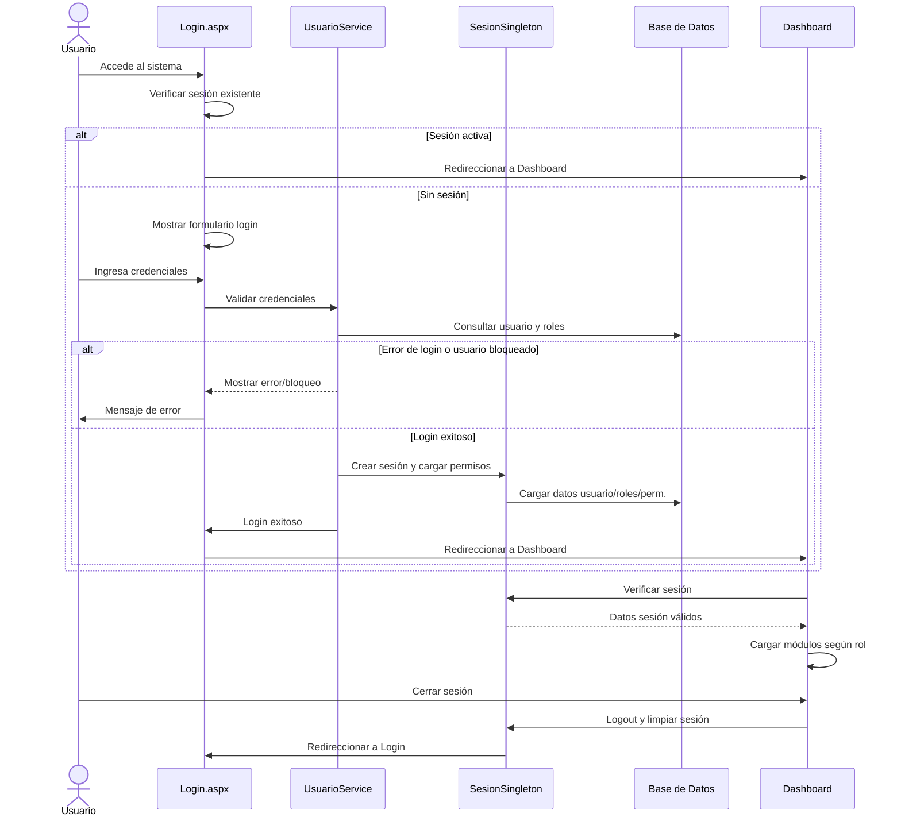
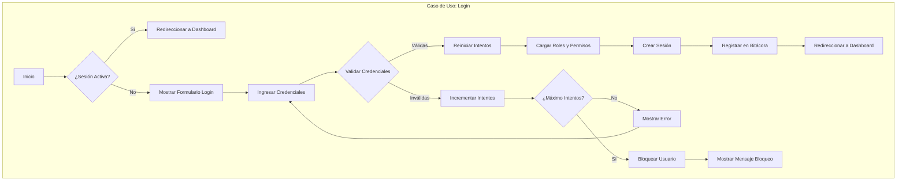

# Diagrama de Secuencia - Autenticación

## 🔐 Ciclo de Vida de Autenticación (Versión Resumida)

## 🔍 Descripción Resumida

- **Validación de Login**: Agrupa la verificación de credenciales, control de intentos y bloqueo.
- **Carga de datos**: Incluye la creación de sesión y la carga de roles y permisos.
- **Logout**: Se resume en un solo paso.

Este diagrama muestra el flujo principal de autenticación de manera compacta y fácil de leer, ideal para documentación técnica y presentaciones.

## 🔍 Descripción de Componentes

### 1. Participantes

- **Usuario**: Interactúa con el sistema
- **Login.aspx**: Interfaz de autenticación
- **UsuarioService**: Lógica de negocio de usuarios
- **SesionSingleton**: Gestión de sesión única
- **Base de Datos**: Almacenamiento persistente
- **BitacoraService**: Registro de auditoría
- **Dashboard**: Interfaz principal del sistema

### 2. Flujos Principales

#### Autenticación Exitosa

1. Usuario ingresa credenciales
2. Sistema valida credenciales
3. Se crea sesión Singleton
4. Se cargan roles y permisos
5. Se registra en bitácora
6. Redirección a Dashboard

#### Autenticación Fallida

1. Usuario ingresa credenciales
2. Sistema valida credenciales
3. Se incrementan intentos fallidos
4. Se muestra mensaje de error
5. Se registra en bitácora

#### Cierre de Sesión

1. Usuario solicita logout
2. Sistema registra en bitácora
3. Se limpia sesión Singleton
4. Redirección a Login

## 🔒 Características de Seguridad

1. **Control de Intentos**

   - Máximo 3 intentos fallidos
   - Bloqueo automático de cuenta
   - Registro en bitácora

2. **Gestión de Sesión**

   - Patrón Singleton
   - Timeout automático
   - Limpieza de recursos

3. **Auditoría**

   - Registro de login/logout
   - Captura de IP y UserAgent
   - Trazabilidad completa

4. **Roles y Permisos**
   - Verificación de roles
   - Carga de permisos
   - Control de acceso

## 📋 Caso de Uso - Login

### Descripción del Caso de Uso

#### Actor Principal

- Usuario del sistema

#### Precondiciones

1. El usuario tiene una cuenta válida en el sistema
2. El usuario no está bloqueado
3. El usuario no tiene una sesión activa

#### Flujo Principal

1. El usuario accede al sistema
2. El sistema verifica si existe una sesión activa
3. Si no hay sesión, se muestra el formulario de login
4. El usuario ingresa sus credenciales
5. El sistema valida las credenciales
6. Si son válidas:
   - Se reinician los intentos fallidos
   - Se cargan roles y permisos
   - Se crea la sesión
   - Se registra en bitácora
   - Se redirecciona al Dashboard

#### Flujos Alternativos

1. **Credenciales Inválidas**

   - Se incrementa contador de intentos
   - Se muestra mensaje de error
   - Se permite reintentar

2. **Usuario Bloqueado**

   - Se muestra mensaje de bloqueo
   - Se requiere intervención administrativa

3. **Sesión Activa**
   - Se redirecciona directamente al Dashboard

#### Postcondiciones

1. Sesión creada exitosamente
2. Usuario autenticado en el sistema
3. Roles y permisos cargados
4. Registro en bitácora generado

#### Reglas de Negocio

1. Máximo 3 intentos fallidos antes del bloqueo
2. Bloqueo requiere desbloqueo administrativo
3. Sesión expira después de 30 minutos de inactividad
4. Registro obligatorio en bitácora de todos los intentos
