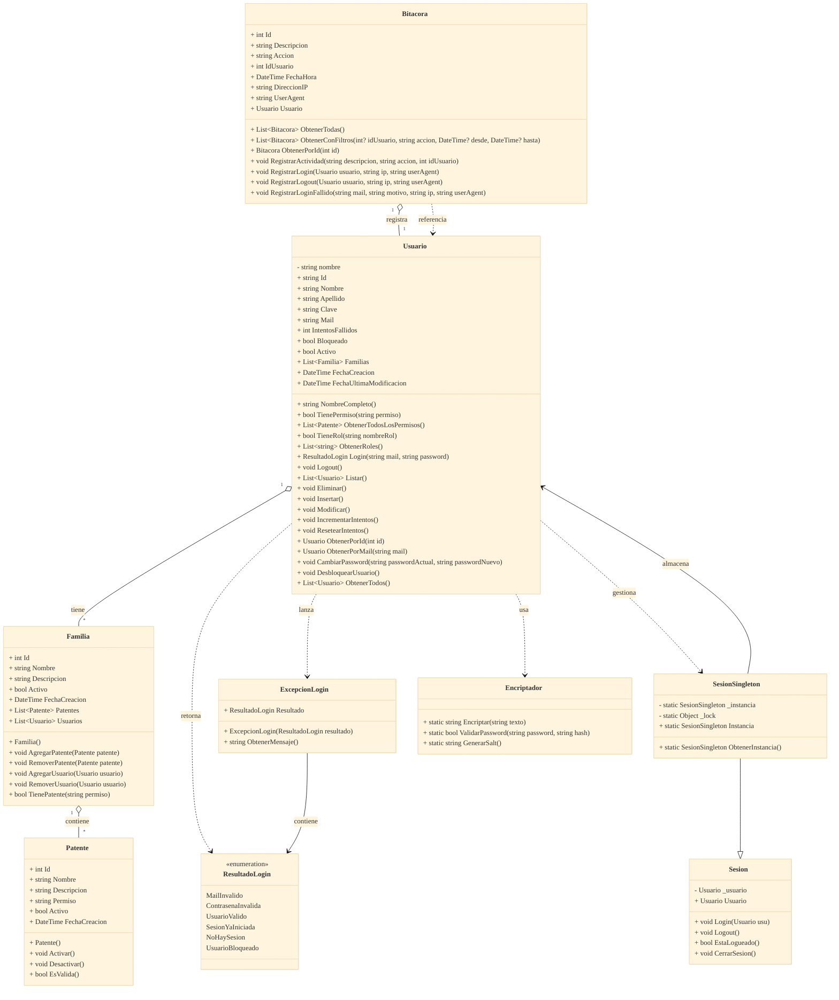

# Diagrama de Clases - Carnicería CRM

## 🏗️ Arquitectura de Clases del Sistema

### Diagrama de Clases del Dominio



## 📋 Descripción de las Clases

### 🎯 **Entidades Principales**

#### **Usuario**

- **Propósito**: Entidad central que representa un usuario del sistema
- **Responsabilidades**:
  - Gestionar información personal y credenciales
  - Autenticación y autorización (métodos de login/logout)
  - Administrar roles y permisos
  - Control de intentos fallidos y bloqueos
  - Operaciones CRUD sobre usuarios

#### **Familia**

- **Propósito**: Representa un rol o familia de permisos
- **Responsabilidades**:
  - Agrupar permisos relacionados
  - Definir niveles de acceso (WebMaster, Carnicero, Cliente)
  - Gestionar la relación N:M con usuarios y patentes
  - Validar permisos dentro del rol

#### **Patente**

- **Propósito**: Representa un permiso específico del sistema
- **Responsabilidades**:
  - Definir acciones granulares del sistema
  - Control de activación/desactivación
  - Validación de permisos

#### **Bitacora**

- **Propósito**: Registro de auditoría de todas las acciones del sistema
- **Responsabilidades**:
  - Registrar trazabilidad completa de operaciones
  - Filtrado y consulta de registros históricos
  - Capturar información de contexto (IP, UserAgent)
  - Generar reportes de auditoría

### 🔧 **Gestión de Sesiones**

#### **Sesion**

- **Propósito**: Clase base para manejo de sesiones de usuario
- **Responsabilidades**:
  - Gestionar estado de autenticación
  - Controlar login/logout
  - Validar sesión activa

#### **SesionSingleton**

- **Propósito**: Implementación Singleton para sesión única global
- **Responsabilidades**:
  - Garantizar una sola sesión por aplicación
  - Thread-safe con patrón de bloqueo
  - Acceso global a la sesión actual

### ⚠️ **Manejo de Excepciones**

#### **ExcepcionLogin**

- **Propósito**: Excepción específica para errores de autenticación
- **Responsabilidades**:
  - Manejo tipado de errores de login
  - Clasificación específica de tipos de fallo
  - Mensajes de error descriptivos

#### **ResultadoLogin**

- **Propósito**: Enumeración de posibles resultados de autenticación
- **Valores**: MailInvalido, ContraseñaInvalida, UsuarioValido, SesionYaIniciada, NoHaySesion, UsuarioBloqueado

### 🛠️ **Utilidades**

#### **Encriptador**

- **Propósito**: Utilidad para encriptación y validación de contraseñas
- **Responsabilidades**:
  - Hasheo seguro con SHA256
  - Validación de contraseñas
  - Generación de sales criptográficas

## 🔗 Relaciones y Patrones

### **1. Relaciones de Herencia**

- `SesionSingleton` hereda de `Sesion` - Especialización del manejo de sesiones
- `ExcepcionLogin` hereda de `Exception` - Excepción especializada

### **2. Relaciones de Agregación**

- `Usuario` ↔ `Familia` (N:M) - Un usuario puede tener múltiples roles
- `Familia` ↔ `Patente` (N:M) - Un rol contiene múltiples permisos
- `Bitacora` → `Usuario` (N:1) - Cada registro pertenece a un usuario

### **3. Dependencias de Uso**

- `Usuario` usa `Encriptador` para manejar contraseñas
- `Usuario` usa `SesionSingleton` para gestionar sesiones
- `Usuario` lanza `ExcepcionLogin` en errores de autenticación
- `Bitacora` referencia `Usuario` para los registros

### **4. Patrones Implementados**

#### **🔄 Singleton Pattern**

```csharp
SesionSingleton.Instancia.Login(usuario);
```

#### **⚠️ Exception Pattern**

```csharp
throw new ExcepcionLogin(ResultadoLogin.ContraseñaInvalida);
```

#### **🎯 Domain Model Pattern**

```csharp
if (usuario.TienePermiso("GestionarUsuarios")) {
    // Permitir acceso
}
```

## 📊 Métricas del Dominio

### **Entidades del Dominio**

- **Principales**: 4 entidades de negocio (Usuario, Familia, Patente, Bitacora)
- **Soporte**: 2 clases de sesión
- **Utilidades**: 1 clase de encriptación
- **Excepciones**: 1 excepción personalizada + 1 enum

### **Complejidad por Clase**

- **Usuario**: 16 métodos (más compleja - entidad central)
- **Bitacora**: 7 métodos (gestión de auditoría)
- **Familia**: 5 métodos (gestión de roles)
- **Patente**: 3 métodos (gestión de permisos)

### **Relaciones**

- **Herencia**: 2 relaciones
- **Agregación**: 3 relaciones principales
- **Dependencias**: 5 relaciones de uso

---

_Diagrama de Clases del Dominio - Carnicería CRM v1.0_
