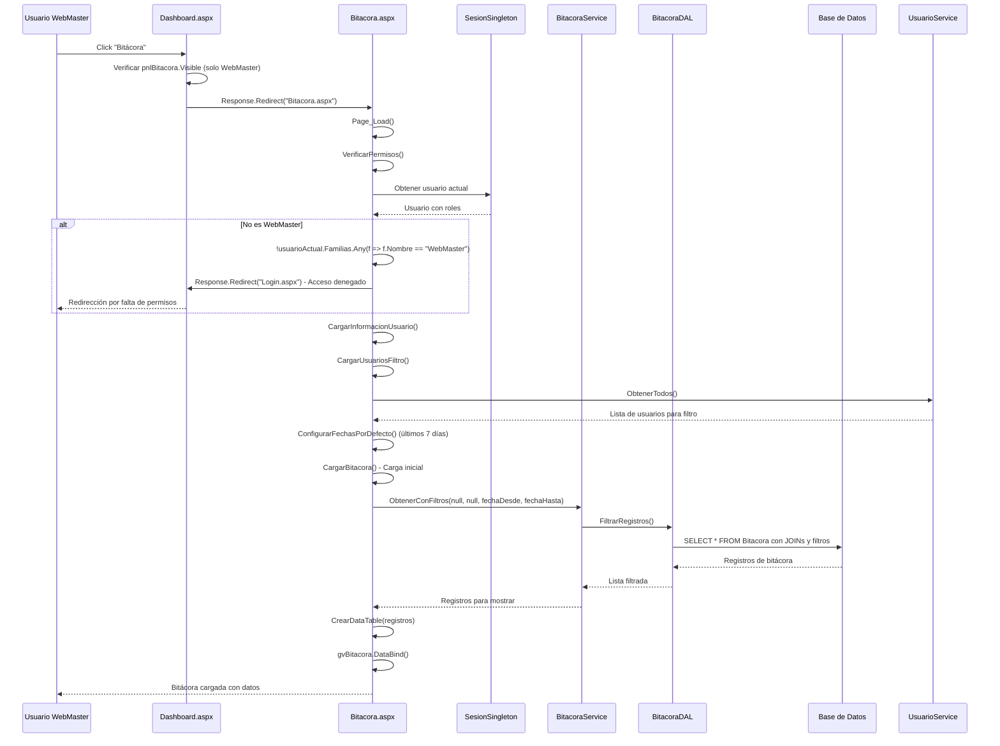
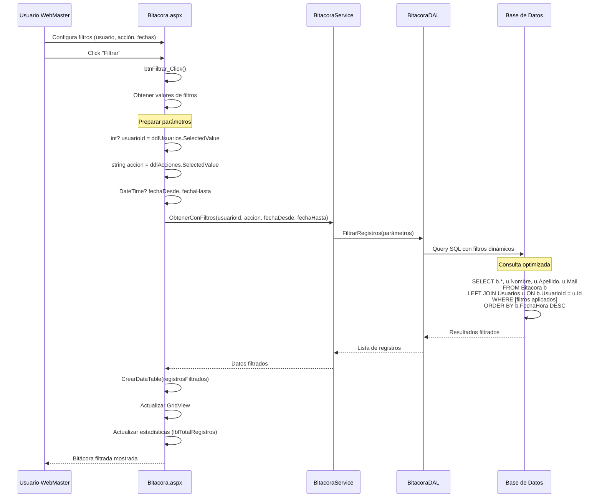
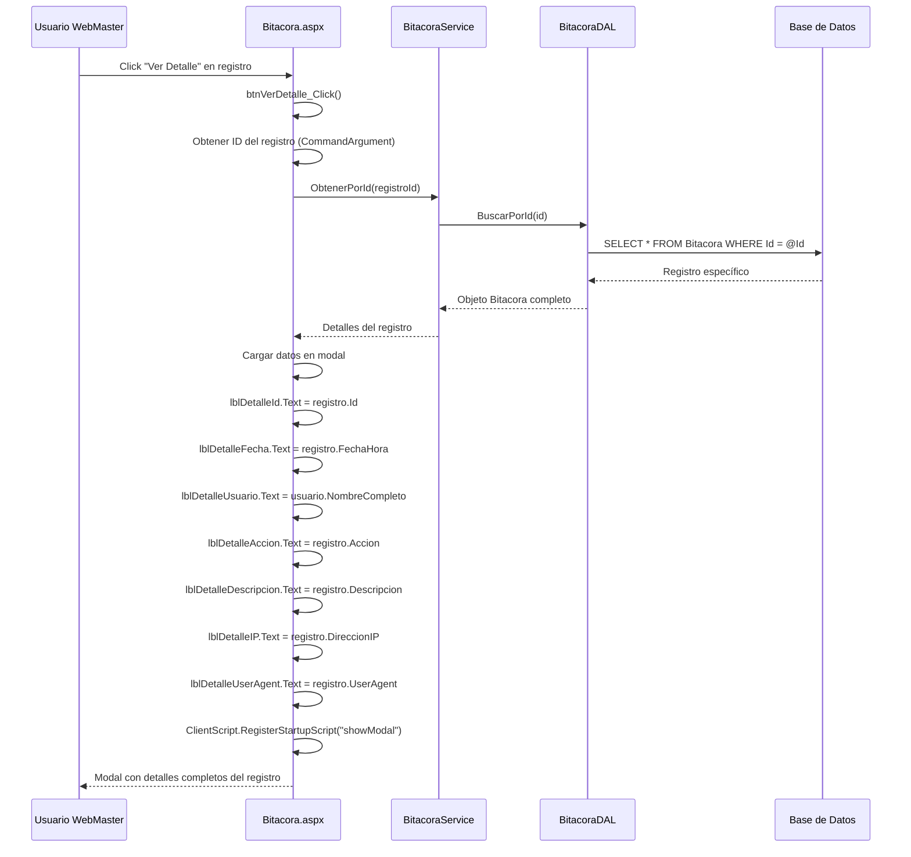
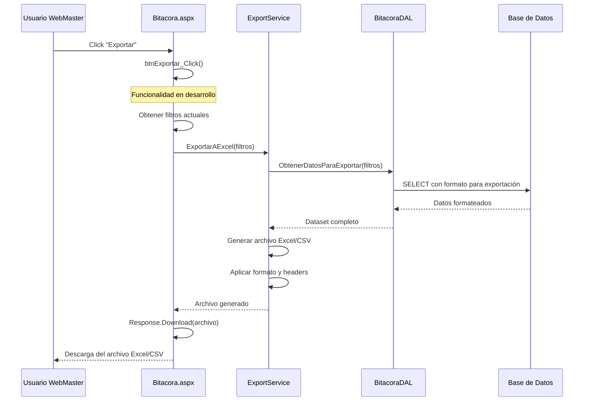

# Diagrama de Secuencia - Consulta de Bitácora

## 📋 Sistema de Auditoría y Consulta de Bitácora

### Acceso a Bitácora con Control de Permisos

### Filtrado Avanzado de Bitácora

### Ver Detalle de Registro

### Exportación de Datos (Futuro)

## 🔍 Características del Sistema de Bitácora

### 1. **Control de Acceso**

- ✅ Solo usuarios con rol WebMaster pueden acceder
- ✅ Verificación en Page_Load y redirección automática
- ✅ Validación de permisos antes de cada operación

### 2. **Filtros Implementados**

- 📅 **Fechas**: Rango configurable (por defecto últimos 7 días)
- 👤 **Usuario**: Dropdown con todos los usuarios del sistema
- 🎯 **Acción**: Filtro por tipo de acción (Login, Logout, etc.)
- 🔄 **Combinados**: Múltiples filtros aplicables simultáneamente

### 3. **Tipos de Registros Auditados**

- 🔐 **Autenticación**: Login exitoso, login fallido, logout
- 🚫 **Seguridad**: Bloqueo de usuarios, intentos fallidos
- 🔑 **Cambios**: Modificación de contraseñas
- 👥 **Usuarios**: Creación, modificación, eliminación
- 📝 **Operaciones**: Todas las acciones críticas del sistema

### 4. **Información Capturada**

- 🕐 **Timestamp**: Fecha y hora exacta
- 👤 **Usuario**: Quien realizó la acción
- 🎯 **Acción**: Qué se hizo
- 📝 **Descripción**: Detalles adicionales
- 🌐 **IP**: Dirección IP del cliente
- 💻 **UserAgent**: Información del navegador

### 5. **Funcionalidades de la Interfaz**

- 📊 **Paginación**: Para manejar grandes volúmenes
- 🔄 **Actualización**: Botón para refrescar datos
- 🔍 **Detalle**: Modal con información completa
- 📤 **Exportación**: Preparado para Excel/CSV (en desarrollo)
- 📈 **Estadísticas**: Contadores y métricas

### 6. **Seguridad y Rendimiento**

- 🛡️ **No eliminación**: Los registros de auditoría son permanentes
- ⚡ **Consultas optimizadas**: Con índices y filtros eficientes
- 🚫 **Solo lectura**: Los registros no pueden ser modificados
- 📊 **Limitación de resultados**: Paginación para evitar sobrecarga

---
