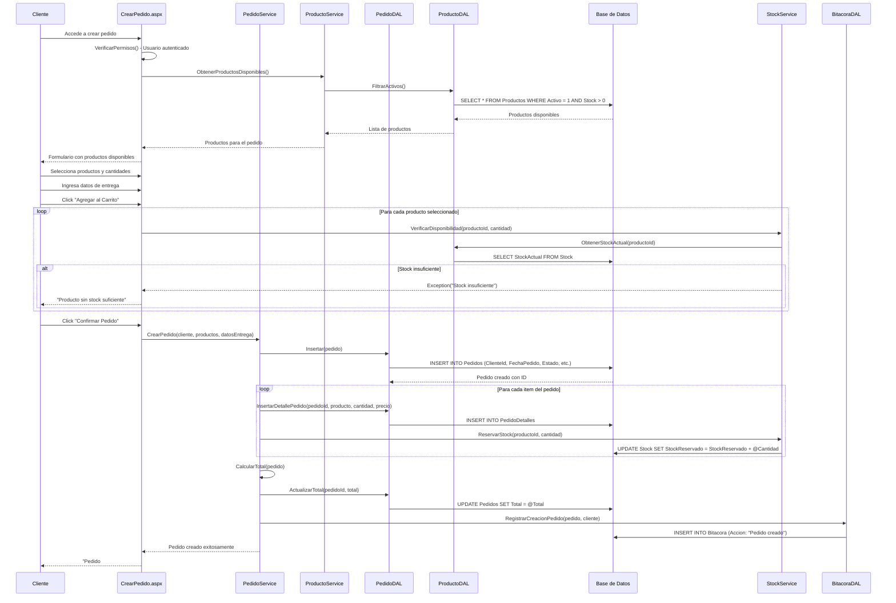
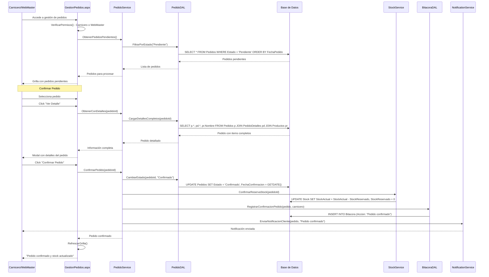
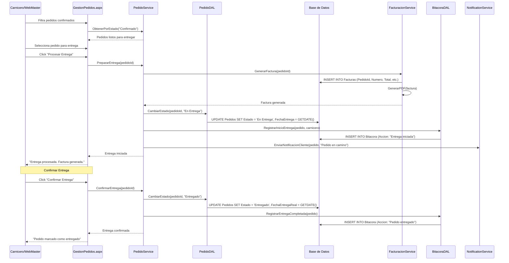
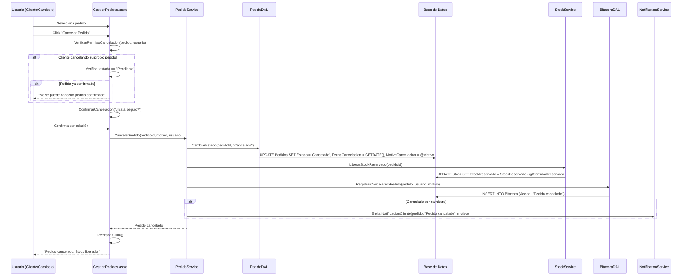
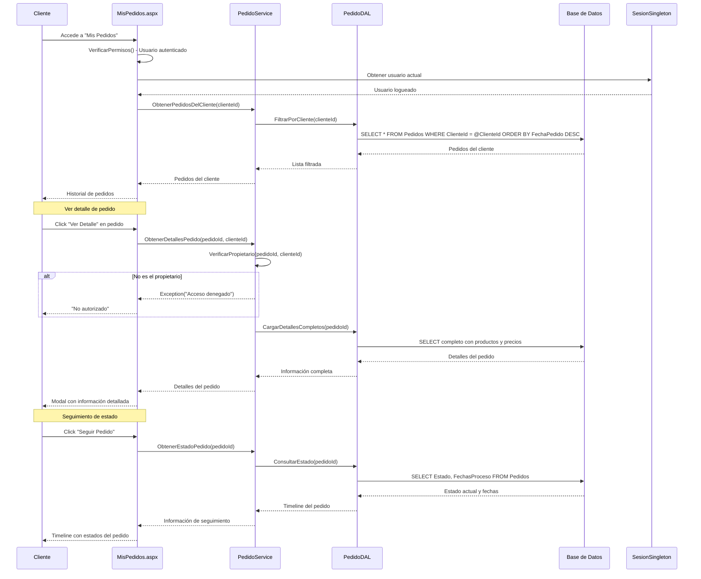
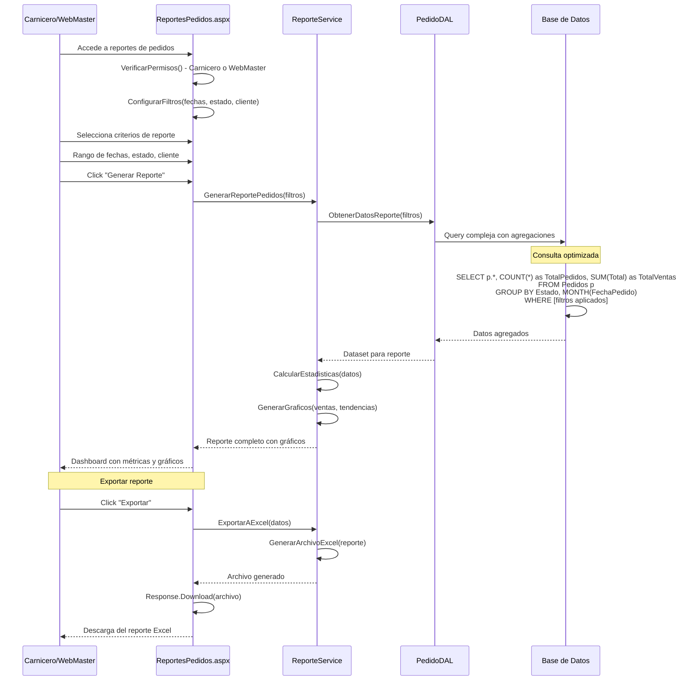

# Diagrama de Secuencia - Gestión de Pedidos

## 🛒 Sistema de Gestión de Pedidos

### Crear Pedido (Cliente)

### Gestión de Pedidos (Carnicero/WebMaster)

### Procesar Entrega

### Cancelar Pedido

### Consulta de Pedidos (Cliente)

### Reportes de Pedidos

## 🛒 Características del Sistema de Pedidos

### 1. **Flujo Completo de Pedidos**

- 📝 **Creación**: Cliente crea pedido con productos disponibles
- ✅ **Confirmación**: Carnicero valida y confirma pedido
- 🚛 **Entrega**: Procesamiento y entrega con facturación
- ✅ **Finalización**: Confirmación de entrega exitosa

### 2. **Gestión de Stock Integrada**

- 📦 **Reserva Automática**: Stock comprometido al crear pedido
- ✅ **Confirmación**: Stock definitivamente asignado
- 🔄 **Liberación**: Stock liberado en cancelaciones
- ⚠️ **Validación**: Verificación en tiempo real

### 3. **Control de Estados**

- 🆕 **Pendiente**: Esperando confirmación
- ✅ **Confirmado**: Aprobado por carnicero
- 🚛 **En Entrega**: Siendo entregado
- ✅ **Entregado**: Completado exitosamente
- ❌ **Cancelado**: Cancelado con motivo

### 4. **Facturación Automática**

- 🧾 **Generación**: Factura automática al confirmar entrega
- 📄 **PDF**: Documento descargable
- 💰 **Cálculos**: Totales e impuestos automáticos
- 📊 **Numeración**: Secuencial y controlada

### 5. **Notificaciones y Seguimiento**

- 📧 **Email**: Notificaciones automáticas al cliente
- 📱 **Dashboard**: Estado en tiempo real
- 📍 **Timeline**: Historial completo del pedido
- 🔔 **Alertas**: Para carniceros sobre pedidos pendientes

### 6. **Reportes y Analíticas**

- 📊 **Ventas**: Por período, cliente, producto
- 📈 **Tendencias**: Análisis temporal
- 💰 **Ingresos**: Totales y promedios
- 📱 **Dashboard**: Métricas en tiempo real
- 📤 **Exportación**: Excel para análisis externo

### 7. **Seguridad y Permisos**

- 🔒 **Segregación**: Clientes solo ven sus pedidos
- 👥 **Roles**: Diferentes permisos por tipo de usuario
- 📝 **Auditoría**: Todos los cambios registrados
- 🛡️ **Validación**: Verificación de propietario

---

_Diagrama generado para Carnicería CRM - Gestión de Pedidos_
