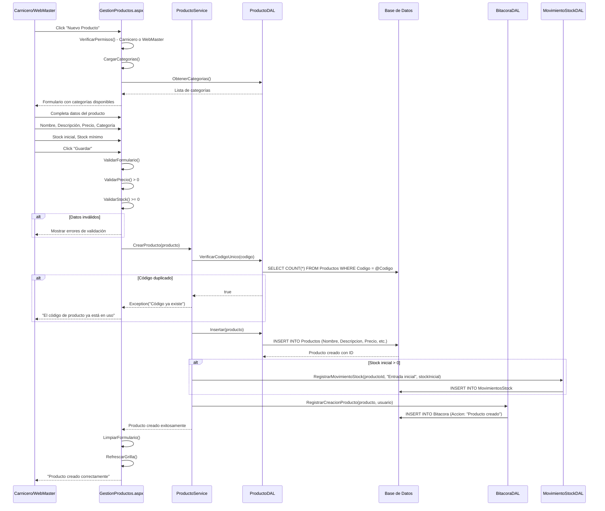
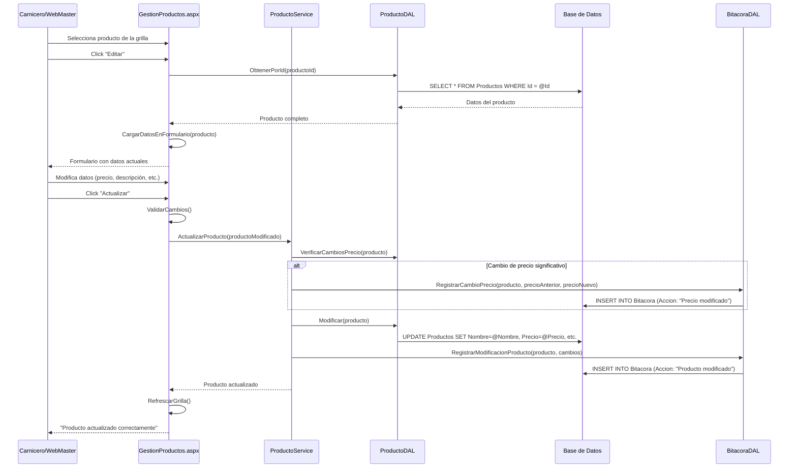
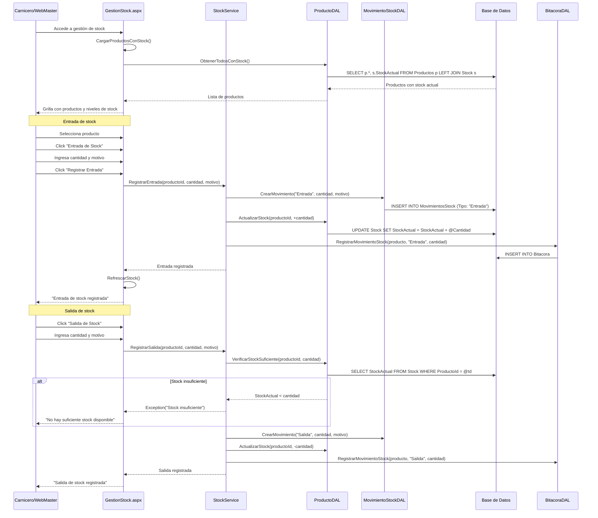
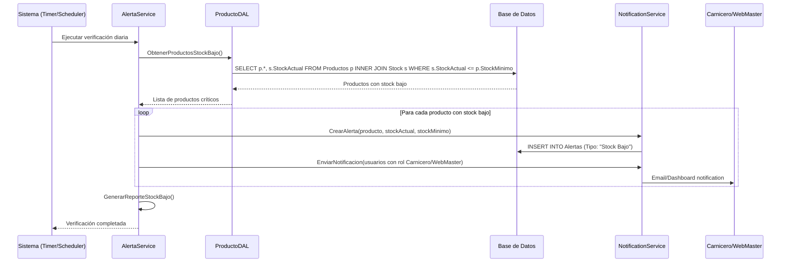
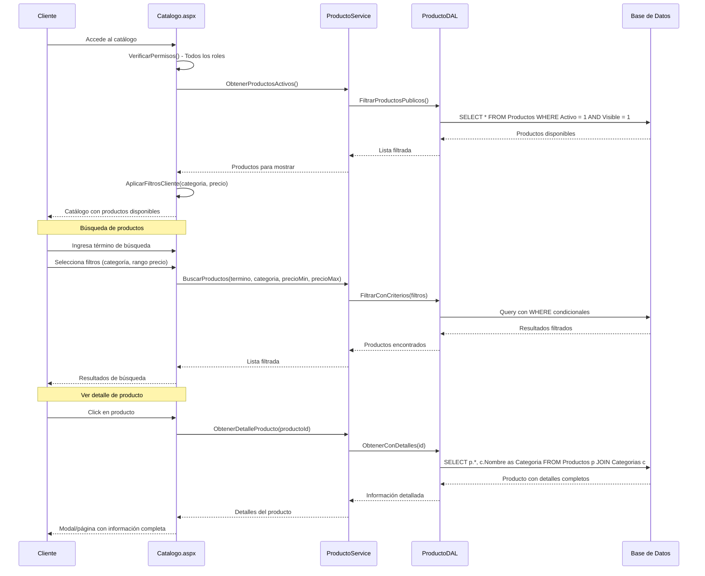

# Diagrama de Secuencia - Gestión de Productos

## 📦 Sistema de Administración de Productos

### Crear Nuevo Producto

### Modificar Producto Existente

### Gestión de Stock

### Alertas de Stock Bajo

### Consulta de Catálogo (Cliente)

## 📦 Características del Sistema de Productos

### 1. **Gestión Completa de Productos**

- ✅ **CRUD Completo**: Crear, leer, actualizar, eliminar
- 📊 **Categorización**: Organización por categorías
- 💰 **Gestión de Precios**: Control de cambios con auditoría
- 📸 **Imágenes**: Soporte para fotos de productos
- 🔍 **Búsqueda Avanzada**: Por múltiples criterios

### 2. **Control de Inventario**

- 📦 **Stock en Tiempo Real**: Actualización automática
- 📈 **Movimientos de Stock**: Entradas y salidas registradas
- ⚠️ **Alertas Automáticas**: Stock bajo y falta de inventario
- 📊 **Histórico**: Trazabilidad completa de movimientos
- 🔄 **Ajustes**: Correcciones de inventario

### 3. **Seguridad y Permisos**

- 🔒 **Control de Acceso**: Por roles (Carnicero/WebMaster)
- 👁️ **Visibilidad**: Productos públicos/privados
- 📝 **Auditoría**: Todos los cambios registrados
- 🛡️ **Validaciones**: Precios, stock, códigos únicos

### 4. **Experiencia del Cliente**

- 🛍️ **Catálogo Público**: Vista optimizada para clientes
- 🔍 **Filtros Intuitivos**: Por categoría, precio, disponibilidad
- 📱 **Responsive**: Adaptado a dispositivos móviles
- ⚡ **Rendimiento**: Carga rápida con paginación

### 5. **Gestión de Categorías**

- 📂 **Organización Jerárquica**: Categorías y subcategorías
- 🏷️ **Etiquetado**: Sistema de tags para productos
- 🔄 **Reasignación**: Cambio de categorías con historial
- 📊 **Estadísticas**: Productos por categoría

### 6. **Integración con Pedidos**

- 🛒 **Disponibilidad Real**: Stock validado en pedidos
- 📉 **Reserva Automática**: Stock comprometido en pedidos
- 🔄 **Liberación**: Stock liberado en cancelaciones
- 📈 **Estadísticas**: Productos más vendidos

---

_Diagrama generado para Carnicería CRM - Gestión de Productos_
