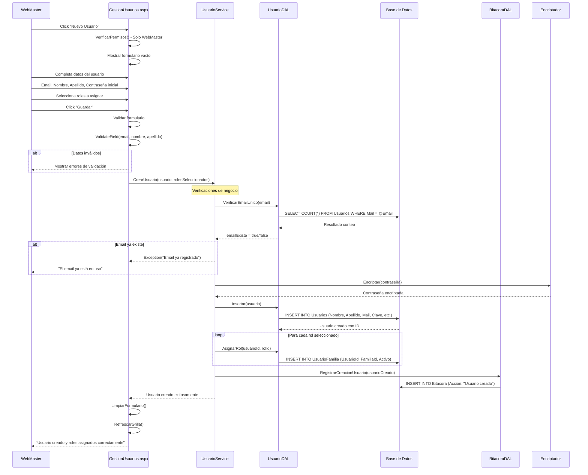
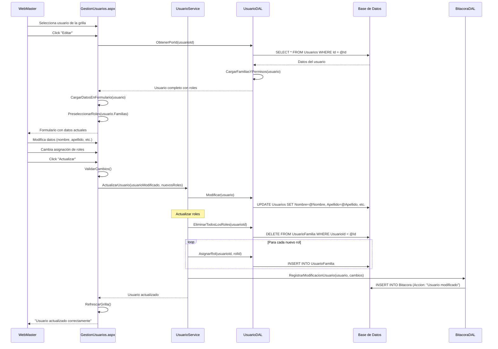
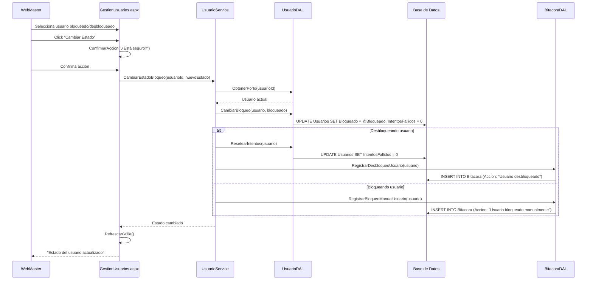
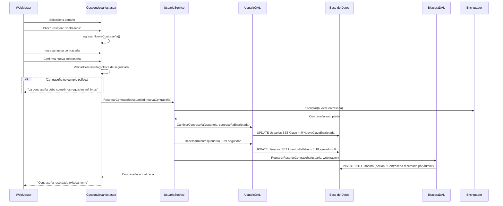
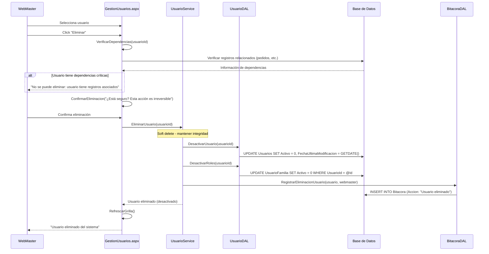
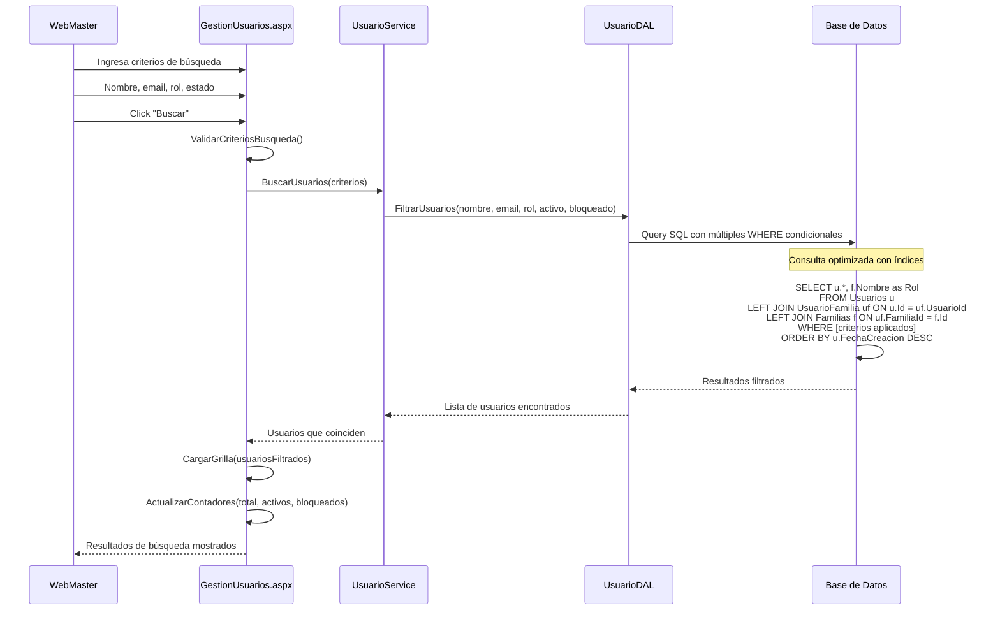

# Diagrama de Secuencia - Gestión de Usuarios

## 👥 Sistema de Administración de Usuarios

### Crear Nuevo Usuario

### Modificar Usuario Existente

### Bloquear/Desbloquear Usuario

### Resetear Contraseña

### Eliminar Usuario (Soft Delete)

### Búsqueda y Filtrado de Usuarios

## 👥 Características del Sistema de Gestión

### 1. **Operaciones CRUD Completas**

- ✅ **Create**: Creación con validaciones y encriptación
- ✅ **Read**: Consulta con roles y permisos cargados
- ✅ **Update**: Modificación con auditoría completa
- ✅ **Delete**: Eliminación lógica (soft delete)

### 2. **Seguridad Implementada**

- 🔐 **Encriptación**: Contraseñas hasheadas
- 🛡️ **Validación**: Email único y políticas de contraseña
- 🔒 **Autorización**: Solo WebMaster puede gestionar usuarios
- 📝 **Auditoría**: Todas las operaciones registradas en bitácora

### 3. **Gestión de Estados**

- ✅ **Activo/Inactivo**: Control de acceso al sistema
- 🚫 **Bloqueado/Desbloqueado**: Gestión de seguridad
- 🔄 **Reset de Intentos**: Limpieza automática en operaciones admin

### 4. **Asignación de Roles**

- 👤 **Múltiples Roles**: Un usuario puede tener varios roles
- 🔄 **Actualización Dinámica**: Cambio de roles sin recrear usuario
- 📊 **Herencia de Permisos**: Roles se reflejan inmediatamente en permisos

### 5. **Búsqueda y Filtrado**

- 🔍 **Criterios Múltiples**: Nombre, email, rol, estado
- ⚡ **Consultas Optimizadas**: Índices en campos de búsqueda
- 📄 **Paginación**: Manejo eficiente de grandes listas

### 6. **Integridad de Datos**

- 🔗 **Verificación de Dependencias**: Antes de eliminar
- 📊 **Soft Delete**: Preservación de datos históricos
- 🔄 **Transacciones**: Operaciones atómicas garantizadas

---

_Diagrama generado para Carnicería CRM - Gestión de Usuarios_
