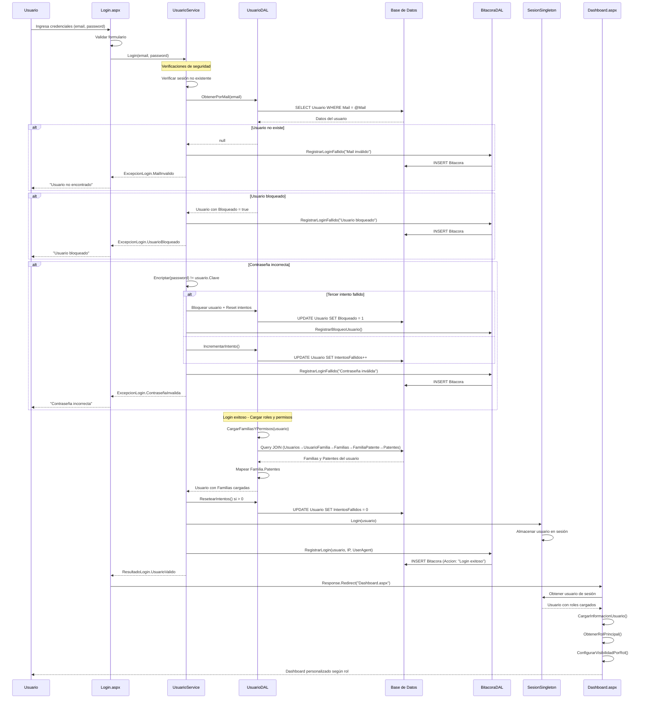
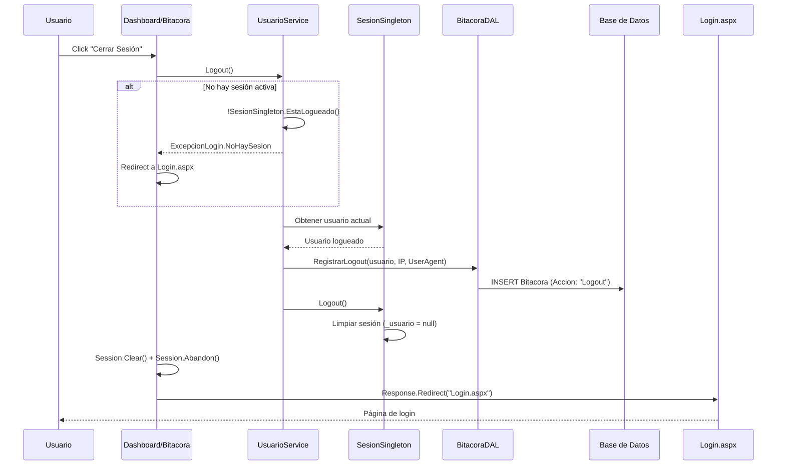
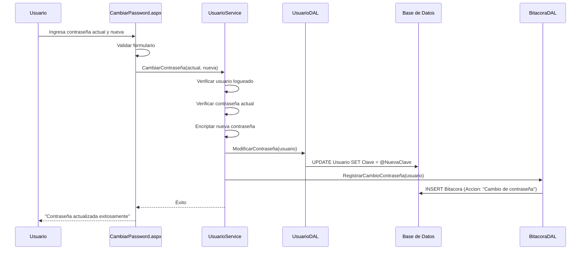

# Diagrama de Secuencia - Login y Autenticación

## 🔐 Proceso de Autenticación Completo

### Login Exitoso con Carga de Roles

### Logout con Registro en Bitácora

### Cambio de Contraseña

## 🔑 Puntos Clave del Sistema

### 1. **Seguridad Implementada**

- ✅ Encriptación de contraseñas
- ✅ Control de intentos fallidos (máx. 3)
- ✅ Bloqueo automático de usuarios
- ✅ Validación de sesiones únicas
- ✅ Registro de auditoría completo

### 2. **Carga de Roles y Permisos**

- ✅ Automática en login exitoso
- ✅ JOIN optimizado con todas las tablas relacionadas
- ✅ Mapeo completo Familias → Patentes
- ✅ Control de activación (Activo = 1)

### 3. **Auditoría y Trazabilidad**

- ✅ Login exitoso
- ✅ Login fallido (con motivo)
- ✅ Logout
- ✅ Bloqueo de usuario
- ✅ Cambio de contraseña
- ✅ IP y UserAgent capturados

### 4. **Manejo de Errores**

- ✅ Excepciones específicas por tipo de error
- ✅ Mensajes amigables al usuario
- ✅ Logging de errores para diagnóstico
- ✅ Fallback seguro en caso de fallas

### 5. **Experiencia de Usuario**

- ✅ Dashboard personalizado por rol
- ✅ Visibilidad de módulos según permisos
- ✅ Mensajes informativos claros
- ✅ Redirección automática post-login

---
