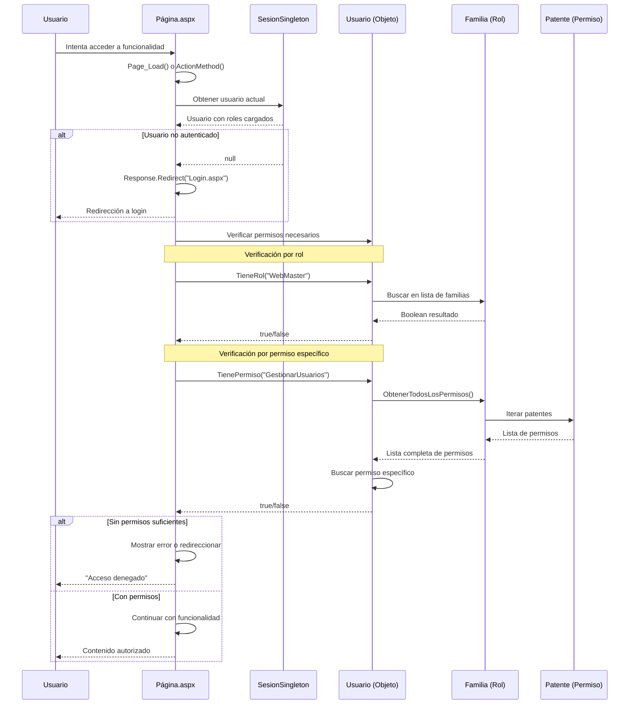
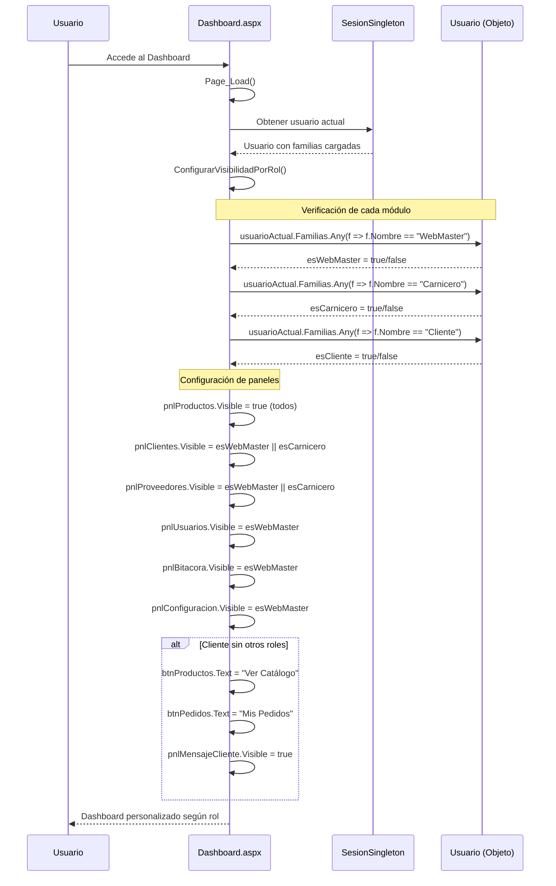
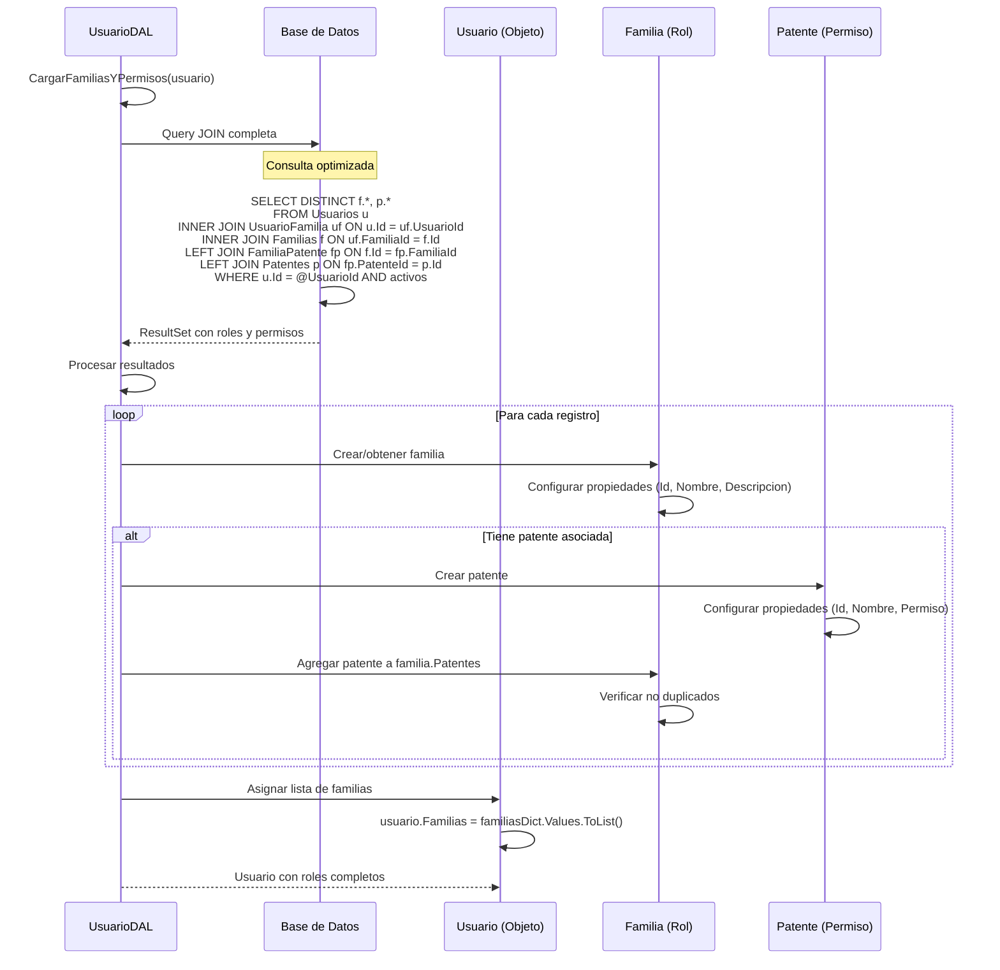
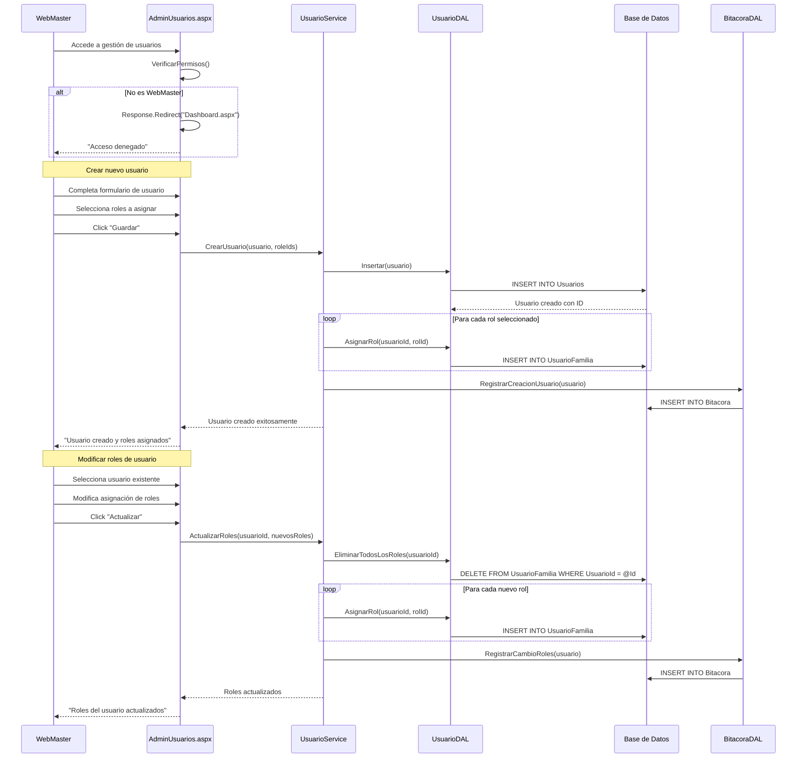

# Diagrama de Secuencia - Gestión de Roles y Permisos

## 🔐 Sistema de Control de Acceso Basado en Roles (RBAC)

### Verificación de Permisos al Acceder a Funcionalidades



### Configuración de Visibilidad en Dashboard



### Carga de Roles y Permisos desde Base de Datos



### Administración de Usuarios (Solo WebMaster)



## 🔐 Arquitectura del Sistema de Permisos

### 1. **Estructura Jerárquica**

```
WebMaster (Administrador)
├── Todas las funciones del Carnicero
├── Gestión de usuarios
├── Configuración de roles
├── Acceso a bitácora
└── Configuración del sistema

Carnicero (Operativo)
├── Todas las funciones del Cliente
├── Gestión de productos
├── Gestión de clientes
├── Procesamiento de pedidos
├── Gestión de proveedores
└── Reportes y estadísticas

Cliente (Usuario final)
├── Ver catálogo de productos
├── Realizar pedidos propios
└── Ver historial personal
```

### 2. **Niveles de Validación**

#### 🔍 **Nivel 1: Autenticación**

- Verificación de sesión activa
- Redirección automática si no autenticado

#### 🎯 **Nivel 2: Autorización por Rol**

- Verificación de rol específico (WebMaster, Carnicero, Cliente)
- Control de visibilidad de módulos completos

#### 🔒 **Nivel 3: Autorización por Permiso**

- Verificación de permisos granulares específicos
- Control de acciones individuales dentro de módulos

### 3. **Patrones de Implementación**

#### 🏗️ **Patrón de Verificación**

```csharp
// En cada página que requiere permisos específicos
private bool VerificarPermisos()
{
    var usuario = SesionSingleton.Instancia.Usuario;
    if (usuario == null) return false;

    // Verificación por rol
    return usuario.TieneRol("WebMaster") ||
           usuario.TienePermiso("PermisoEspecifico");
}
```

#### 🔄 **Patrón de Carga Diferida**

- Roles y permisos se cargan una sola vez en el login
- Se mantienen en memoria durante toda la sesión
- No requiere consultas adicionales para verificaciones

### 4. **Beneficios del Sistema**

#### ✅ **Seguridad**

- Control granular de acceso
- Segregación clara de responsabilidades
- Auditoría completa de acciones

#### ⚡ **Rendimiento**

- Carga única en login
- Verificaciones en memoria
- Sin consultas repetitivas a BD

#### 🔧 **Mantenibilidad**

- Roles configurables desde base de datos
- Permisos granulares y extensibles
- Lógica centralizada y reutilizable

---
