# 🎯 Diagrama de Navegación Visual - Carnicería CRM

## 📱 Esquema de Navegación por Perfiles

```mermaid
flowchart TD
    %% Perfil Público
    A["`**Perfil Público**
    *(sin login)*`"] --> A1["`🏠
    **Inicio**
    Inicio.aspx`"]
    A --> A2["`🔑
    **Login**
    Login.aspx`"]
    A --> A3["`📝
    **Registro**
    *(No implementado)*`"]
    A --> A4["`📞
    **Contacto**
    *(No implementado)*`"]

    %% WebMaster
    WM["`**WebMaster**
    *(Perfil: WebMaster)*`"] --> WM_L["`🔑
    **Login**
    Login.aspx`"]

    WM_L --> WM_D["`🏠
    **Dashboard**
    Dashboard.aspx`"]

    WM_D --> WM1["`👥
    **Usuarios**
    *(En desarrollo)*`"]
    WM_D --> WM2["`📊
    **Bitácora**
    Bitacora.aspx`"]
    WM_D --> WM3["`⚙️
    **Configuración**
    *(En desarrollo)*`"]
    WM_D --> WM4["`💾
    **Backup DB**
    Dashboard.aspx`"]
    WM_D --> WM5["`🔍
    **Verificar Integridad**
    Dashboard.aspx`"]
    WM_D --> WM6["`📦
    **Productos**
    *(En desarrollo)*`"]
    WM_D --> WM7["`👤
    **Clientes**
    *(En desarrollo)*`"]
    WM_D --> WM8["`🛒
    **Pedidos**
    *(En desarrollo)*`"]
    WM_D --> WM9["`🚚
    **Proveedores**
    *(En desarrollo)*`"]
    WM_D --> WM10["`📈
    **Reportes**
    *(En desarrollo)*`"]

    %% Carnicero
    C["`**Carnicero**
    *(Perfil: Carnicero)*`"] --> C_L["`🔑
    **Login**
    Login.aspx`"]

    C_L --> C_D["`🏠
    **Dashboard**
    Dashboard.aspx`"]

    C_D --> C1["`📦
    **Productos**
    *(En desarrollo)*`"]
    C_D --> C2["`👤
    **Clientes**
    *(En desarrollo)*`"]
    C_D --> C3["`🛒
    **Pedidos**
    *(En desarrollo)*`"]
    C_D --> C4["`🚚
    **Proveedores**
    *(En desarrollo)*`"]
    C_D --> C5["`📈
    **Reportes**
    *(En desarrollo)*`"]

    %% Cliente
    CL["`**Cliente**
    *(Perfil: Cliente)*`"] --> CL_L["`🔑
    **Login**
    Login.aspx`"]

    CL_L --> CL_D["`🏠
    **Dashboard**
    Dashboard.aspx`"]

    CL_D --> CL1["`📋
    **Catálogo**
    *(En desarrollo)*`"]
    CL_D --> CL2["`📄
    **Mis Pedidos**
    *(En desarrollo)*`"]
    CL_D --> CL3["`👤
    **Mi Perfil**
    *(En desarrollo)*`"]
    CL_D --> CL4["`📧
    **Mis Mensajes**
    *(En desarrollo)*`"]

    %% Estilos para los nodos
    classDef publicStyle fill:#e3f2fd,stroke:#1976d2,stroke-width:3px,color:#000
    classDef webmasterStyle fill:#fff3e0,stroke:#f57c00,stroke-width:3px,color:#000
    classDef carniceroStyle fill:#f3e5f5,stroke:#7b1fa2,stroke-width:3px,color:#000
    classDef clienteStyle fill:#e8f5e8,stroke:#388e3c,stroke-width:3px,color:#000
    classDef loginStyle fill:#fff8e1,stroke:#fbc02d,stroke-width:4px,color:#000
    classDef dashboardStyle fill:#fce4ec,stroke:#c2185b,stroke-width:4px,color:#000
    classDef implementedStyle fill:#c8e6c9,stroke:#2e7d32,stroke-width:3px,color:#000
    classDef notImplementedStyle fill:#ffcdd2,stroke:#d32f2f,stroke-width:2px,stroke-dasharray: 5 5,color:#000

    %% Aplicar estilos
    class A,A1,A2,A3,A4 publicStyle
    class WM,WM1,WM2,WM3,WM4,WM5,WM6,WM7,WM8,WM9,WM10 webmasterStyle
    class C,C1,C2,C3,C4,C5 carniceroStyle
    class CL,CL1,CL2,CL3,CL4 clienteStyle
    class WM_L,C_L,CL_L loginStyle
    class WM_D,C_D,CL_D dashboardStyle
    class A1,A2,WM_L,C_L,CL_L,WM_D,C_D,CL_D,WM2,WM4,WM5 implementedStyle
    class A3,A4,WM1,WM3,WM6,WM7,WM8,WM9,WM10,C1,C2,C3,C4,C5,CL1,CL2,CL3,CL4 notImplementedStyle
```



---

## 🔐 Matriz de Permisos por Perfil

| Funcionalidad              | 🌐 Público | 🟢 Cliente    | 🟡 Carnicero | 🔴 WebMaster   |
| -------------------------- | ---------- | ------------- | ------------ | -------------- |
| **🏠 Página Inicio**       | ✅         | ✅            | ✅           | ✅             |
| **🔑 Login/Logout**        | ✅         | ✅            | ✅           | ✅             |
| **🏠 Dashboard**           | ❌         | ✅            | ✅           | ✅             |
| **📦 Ver Productos**       | ❌         | ✅ (Catálogo) | ✅ (Gestión) | ✅ (Completo)  |
| **👤 Gestión Clientes**    | ❌         | ❌            | ✅           | ✅             |
| **🛒 Gestión Pedidos**     | ❌         | ✅ (Propios)  | ✅ (Todos)   | ✅ (Completo)  |
| **🚚 Gestión Proveedores** | ❌         | ❌            | ✅           | ✅             |
| **📈 Reportes**            | ❌         | ❌            | ✅ (Básicos) | ✅ (Completos) |
| **👥 Gestión Usuarios**    | ❌         | ❌            | ❌           | ✅             |
| **📊 Bitácora**            | ❌         | ❌            | ❌           | ✅             |
| **⚙️ Configuración**       | ❌         | ❌            | ❌           | ✅             |
| **💾 Backup/Integridad**   | ❌         | ❌            | ❌           | ✅             |

---

## 🎯 Flujo de Usuario Típico

### 🔴 **WebMaster - Flujo Administrativo**

```
1. 🔑 Login (Login.aspx)
   ↓
2. 🏠 Dashboard (Dashboard.aspx)
   ├── 📊 Revisar estadísticas del día
   ├── 🔍 Verificar integridad de datos
   └── 💾 Realizar backup si es necesario
   ↓
3. 📊 Bitácora (Bitacora.aspx)
   ├── 🔍 Filtrar por usuario/fecha/acción
   ├── 📋 Revisar actividades recientes
   └── 📄 Exportar reportes si necesario
   ↓
4. 👥 Gestión de Usuarios (*En desarrollo)
   ├── ➕ Crear nuevos usuarios
   ├── ✏️ Modificar roles y permisos
   └── 🔒 Bloquear/desbloquear cuentas
```

### 🟡 **Carnicero - Flujo Operativo**

```
1. 🔑 Login (Login.aspx)
   ↓
2. 🏠 Dashboard (Dashboard.aspx)
   └── 📊 Ver estadísticas operativas
   ↓
3. 📦 Gestión Productos (*En desarrollo)
   ├── 📋 Revisar stock actual
   ├── ➕ Agregar nuevos productos
   └── 📦 Actualizar inventario
   ↓
4. 🛒 Gestión Pedidos (*En desarrollo)
   ├── 📋 Ver pedidos pendientes
   ├── ✅ Procesar pedidos
   └── 📄 Generar facturas
```

### 🟢 **Cliente - Flujo de Compra**

```
1. 🔑 Login (Login.aspx)
   ↓
2. 🏠 Dashboard (Dashboard.aspx)
   └── 📋 Ver resumen personal
   ↓
3. 📋 Catálogo (*En desarrollo)
   ├── 🔍 Buscar productos
   ├── 📦 Seleccionar productos
   └── 🛒 Agregar al pedido
   ↓
4. 📄 Mis Pedidos (*En desarrollo)
   ├── 📋 Ver historial
   ├── 📍 Seguir estado de pedidos
   └── 💰 Ver facturas
```

---

## 🗂️ Archivos y Páginas del Sistema

### **📄 Páginas Implementadas**

| Archivo          | Descripción                       | Acceso         |
| ---------------- | --------------------------------- | -------------- |
| `Inicio.aspx`    | Página de bienvenida pública      | 🌐 Todos       |
| `Login.aspx`     | Autenticación de usuarios         | 🌐 Todos       |
| `Dashboard.aspx` | Panel principal dinámico por rol  | 🔒 Autenticado |
| `Bitacora.aspx`  | Consulta de auditoría del sistema | 🔴 WebMaster   |

### **📁 Estructura de Archivos**

```
📁 CarniceriaCRM/
├── 📄 Global.asax (.NET Application lifecycle)
├── 📄 Web.config (Configuración general)
├── 📁 Content/ (CSS y recursos)
├── 📁 JS/ (JavaScript)
├── 📁 bin/ (Assemblies compilados)
└── 📁 Properties/ (Metadatos del proyecto)

📁 CarniceriaCRM.BE/ (Business Entities)
├── 📄 Usuario.cs (Modelo de usuario)
├── 📄 Familia.cs (Roles del sistema)
├── 📄 Patente.cs (Permisos individuales)
├── 📄 Bitacora.cs (Registro de auditoría)
└── 📄 PermisosEnum.cs (32 permisos definidos)

📁 CarniceriaCRM.BLL/ (Business Logic)
├── 📄 UsuarioService.cs (Lógica de usuarios)
├── 📄 BitacoraService.cs (Lógica de auditoría)
└── 📄 Encriptador.cs (Utilidad SHA256)

📁 CarniceriaCRM.DAL/ (Data Access)
├── 📄 UsuarioDAL.cs (Acceso a datos usuarios)
└── 📄 BitacoraDAL.cs (Acceso a datos bitácora)
```

---

**🎉 Sistema con arquitectura sólida y navegación clara por roles, listo para expansión modular.**
