# 🗺️ Mapa de Navegación - Carnicería CRM

## 📊 Flujo de Navegación del Sistema

```mermaid
graph TD
    %% Acceso Público (Sin Login)
    A[🌐 Perfil Público<br/>sin login] --> A1[📄 Inicio<br/>Inicio.aspx]
    A[🌐 Perfil Público<br/>sin login] --> A2[🔑 Login<br/>Login.aspx]
    A[🌐 Perfil Público<br/>sin login] --> A3[📝 Registro<br/>*No implementado]
    A[🌐 Perfil Público<br/>sin login] --> A4[📞 Contacto<br/>*No implementado]

    %% WebMaster Flow
    WM[👨‍💼 WebMaster<br/>Administrador Completo] --> WM_LOGIN[🔑 Login<br/>Login.aspx]
    WM_LOGIN --> WM_DASH[🏠 Dashboard<br/>Dashboard.aspx]

    WM_DASH --> WM1[👥 Usuarios<br/>*En desarrollo]
    WM_DASH --> WM2[📊 Bitácora<br/>Bitacora.aspx]
    WM_DASH --> WM3[⚙️ Configuración<br/>*En desarrollo]
    WM_DASH --> WM4[🔧 Backup DB<br/>Dashboard.aspx]
    WM_DASH --> WM5[🔍 Verificar Integridad<br/>Dashboard.aspx]
    WM_DASH --> WM6[📦 Productos<br/>*En desarrollo]
    WM_DASH --> WM7[👤 Clientes<br/>*En desarrollo]
    WM_DASH --> WM8[🛒 Pedidos<br/>*En desarrollo]
    WM_DASH --> WM9[🚚 Proveedores<br/>*En desarrollo]
    WM_DASH --> WM10[📈 Reportes<br/>*En desarrollo]

    %% Carnicero Flow
    C[🥩 Carnicero<br/>Personal Operativo] --> C_LOGIN[🔑 Login<br/>Login.aspx]
    C_LOGIN --> C_DASH[🏠 Dashboard<br/>Dashboard.aspx]

    C_DASH --> C1[📦 Productos<br/>*En desarrollo]
    C_DASH --> C2[👤 Clientes<br/>*En desarrollo]
    C_DASH --> C3[🛒 Pedidos<br/>*En desarrollo]
    C_DASH --> C4[🚚 Proveedores<br/>*En desarrollo]
    C_DASH --> C5[📈 Reportes<br/>*En desarrollo]

    %% Cliente Flow
    CL[🛍️ Cliente<br/>Acceso Limitado] --> CL_LOGIN[🔑 Login<br/>Login.aspx]
    CL_LOGIN --> CL_DASH[🏠 Dashboard<br/>Dashboard.aspx]

    CL_DASH --> CL1[📋 Ver Catálogo<br/>*En desarrollo]
    CL_DASH --> CL2[📄 Mis Pedidos<br/>*En desarrollo]
    CL_DASH --> CL3[👤 Mi Perfil<br/>*En desarrollo]

    %% Estilos
    classDef publicClass fill:#e1f5fe,stroke:#01579b,stroke-width:2px
    classDef webmasterClass fill:#fff3e0,stroke:#e65100,stroke-width:2px
    classDef carniceroClass fill:#f3e5f5,stroke:#4a148c,stroke-width:2px
    classDef clienteClass fill:#e8f5e8,stroke:#1b5e20,stroke-width:2px
    classDef loginClass fill:#fff8e1,stroke:#f57f17,stroke-width:3px
    classDef dashboardClass fill:#fce4ec,stroke:#880e4f,stroke-width:3px
    classDef implementedClass fill:#c8e6c9,stroke:#2e7d32,stroke-width:2px
    classDef notImplementedClass fill:#ffcdd2,stroke:#c62828,stroke-width:1px,stroke-dasharray: 5 5

    %% Aplicar estilos
    class A,A1,A2,A3,A4 publicClass
    class WM,WM1,WM2,WM3,WM4,WM5,WM6,WM7,WM8,WM9,WM10 webmasterClass
    class C,C1,C2,C3,C4,C5 carniceroClass
    class CL,CL1,CL2,CL3 clienteClass
    class WM_LOGIN,C_LOGIN,CL_LOGIN loginClass
    class WM_DASH,C_DASH,CL_DASH dashboardClass
    class A1,A2,WM_LOGIN,C_LOGIN,CL_LOGIN,WM_DASH,C_DASH,CL_DASH,WM2 implementedClass
    class A3,A4,WM1,WM3,WM6,WM7,WM8,WM9,WM10,C1,C2,C3,C4,C5,CL1,CL2,CL3 notImplementedClass
```



---

## 🎭 Roles y Permisos Detallados

### 🔴 **WebMaster (Administrador)**

```
✅ Funciones Implementadas:
├── 🔑 Login con validación completa
├── 🏠 Dashboard principal con estadísticas
├── 📊 Bitácora completa de auditoría
├── 🔧 Backup de base de datos
├── 🔍 Verificación de integridad (DVH/DVV)
└── 🚪 Logout con registro en bitácora

🔄 Funciones Preparadas (Base de datos lista):
├── 👥 Gestión completa de usuarios
├── ⚙️ Configuración del sistema
├── 📦 Gestión de productos e inventario
├── 👤 Administración de clientes
├── 🛒 Procesamiento de pedidos
├── 🚚 Gestión de proveedores
└── 📈 Reportes y estadísticas avanzadas
```

### 🟡 **Carnicero (Personal Operativo)**

```
✅ Funciones Implementadas:
├── 🔑 Login con control de intentos
├── 🏠 Dashboard personalizado por rol
└── 🚪 Logout con auditoría

🔄 Funciones Preparadas:
├── 📦 Gestión de productos (CRUD + Stock)
├── 👤 Administración de clientes
├── 🛒 Procesamiento de pedidos
├── 🚚 Gestión de proveedores
└── 📈 Reportes operativos
```

### 🟢 **Cliente (Acceso Público)**

```
✅ Funciones Implementadas:
├── 🔑 Login básico
├── 🏠 Dashboard simplificado
└── 🚪 Logout

🔄 Funciones Preparadas:
├── 📋 Catálogo de productos (solo lectura)
├── 📄 Historial de pedidos propios
└── 👤 Gestión de perfil personal
```

---

## 🏗️ Arquitectura Técnica

### **🔄 Flujo de Autenticación**

```
Usuario → Login.aspx → UsuarioService.Login() →
    ↓
Validaciones de Seguridad:
├── ✅ Email válido en BD
├── ✅ Contraseña SHA256
├── ✅ Usuario no bloqueado
├── ✅ Control de intentos fallidos
└── ✅ Registro en bitácora

    ↓
SesionSingleton.Login() → Dashboard.aspx
```

### **🔐 Sistema de Seguridad**

- **Encriptación**: SHA256 para contraseñas
- **Bloqueo**: Automático tras 3 intentos fallidos
- **Sesión**: Singleton pattern para control único
- **Auditoría**: Registro completo en bitácora
- **Integridad**: DVH/DVV para verificación de datos
