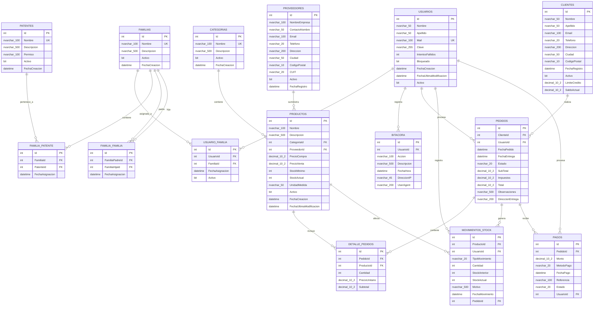

# Diagrama Entidad-Relación - Carnicería CRM

## DER Completo del Sistema

## Descripción de Entidades

### SISTEMA DE PERMISOS Y ROLES

#### PATENTES

- Permisos individuales del sistema (hojas del composite)
- Cada patente representa una acción específica que se puede realizar
- Ejemplos: "VerProductos", "CrearClientes", "GestionarUsuarios"

#### FAMILIAS

- Roles que agrupan patentes y/o otras familias (composite)
- Permiten crear jerarquías de permisos
- Ejemplos de roles: "WebMaster", "Carnicero", "Cliente"

#### FAMILIA_PATENTE

- Relación many-to-many entre familias y patentes
- Una familia puede tener múltiples patentes
- Una patente puede estar en múltiples familias

#### FAMILIA_FAMILIA

- Relación jerárquica entre familias (composite pattern)
- Permite que una familia contenga otras familias
- Evita ciclos recursivos mediante validaciones

#### USUARIO_FAMILIA

- Asignación de roles (familias) a usuarios
- Un usuario puede tener múltiples roles
- Control de activación/desactivación de roles

### USUARIOS

- Gestión de usuarios del sistema con control de acceso y seguridad
- Control de intentos fallidos y bloqueo de usuarios
- Auditoría de cambios
- **Integración con sistema de permisos mediante USUARIO_FAMILIA**

### BITACORA

- Registro de todas las acciones importantes del sistema
- Rastrea inicios de sesión y actividades críticas
- Incluye información de contexto (IP, User Agent)

### CLIENTES

- Información completa de clientes
- Control de crédito y límites
- Gestión de contacto y ubicación

### PRODUCTOS

- Catálogo completo de productos de la carnicería
- Control de precios y stock
- Relación con categorías y proveedores

### CATEGORIAS

- Organización de productos por tipo
- Estructura jerárquica simple

### PROVEEDORES

- Gestión de proveedores
- Información fiscal y de contacto

### PEDIDOS

- Gestión completa de pedidos de clientes
- Estados de pedido y seguimiento
- Información de entrega

### DETALLE_PEDIDOS

- Líneas individuales de cada pedido
- Precios y cantidades específicas

### MOVIMIENTOS_STOCK

- Auditoría completa de movimientos de inventario
- Trazabilidad de cambios en stock
- Vinculación con pedidos

### PAGOS

- Gestión de pagos de pedidos
- Múltiples métodos de pago
- Estados de pago y referencias

## Roles Predefinidos del Sistema

### 🔧 WebMaster

- **Descripción**: Administrador completo del sistema
- **Permisos**: Todos los permisos disponibles
- **Acceso**: Configuración del sistema, gestión de usuarios, permisos, etc.

### 🥩 Carnicero

- **Descripción**: Personal operativo de la carnicería
- **Permisos**:
  - Gestión de productos, stock, categorías
  - Procesamiento de pedidos y ventas
  - Gestión de clientes
  - Generación de reportes operativos
- **Restricciones**: No puede gestionar usuarios ni configuración del sistema

### 👤 Cliente

- **Descripción**: Usuarios con acceso limitado de consulta
- **Permisos**:
  - Ver productos y precios
  - Consultar sus propios pedidos
  - Ver historial de compras
- **Restricciones**: Solo lectura, no puede modificar datos del sistema
